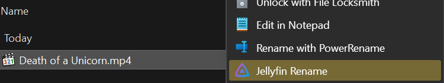

# Jellyfin Renamer

A simple windows context menu tool to help rename media files for compatibility with [Jellyfin](https://jellyfin.org/), an open-source media server.

## Features

- Batch renames files to match Jellyfin's naming conventions
- Supports movies and TV shows

## Usage

1. Clone this repository.
2. Run `install.bat`
3. Right click on the file(s) you want to rename.

